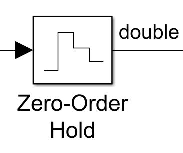
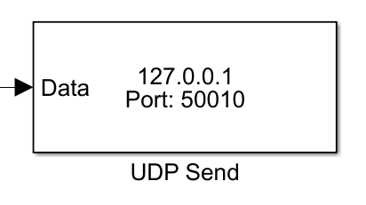

# MATLAB / Simulink Setup

The project was intended to work with the hand of simulink for simulating the dynamics of the system, in which the output of this simulation was in the form of a rigid body dynamics state vector, composed of six elements (Translation, Rotation).

The signals to visualized should go into a filtering process due to Simulink handling some event in a continuous domain form. 

First the signal should be discretized, this with the help of the built-in block *Zero-Order Hold*:

This Block will also define the framerate and quality of the visualization, so be carefull when handling custom sampling rates, or Simulink's Variable sampling rate.

To create a socket to sink the vector signal the UDP send should be used, just give the block the desired remote port and address to match that of Blender's addon and run the simulation at a real time pace to visualize correctly.

The sample MATLAB files can be found [here](MATLAB_examples)