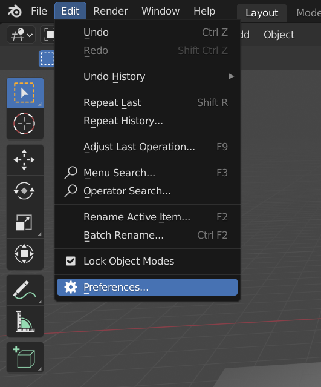
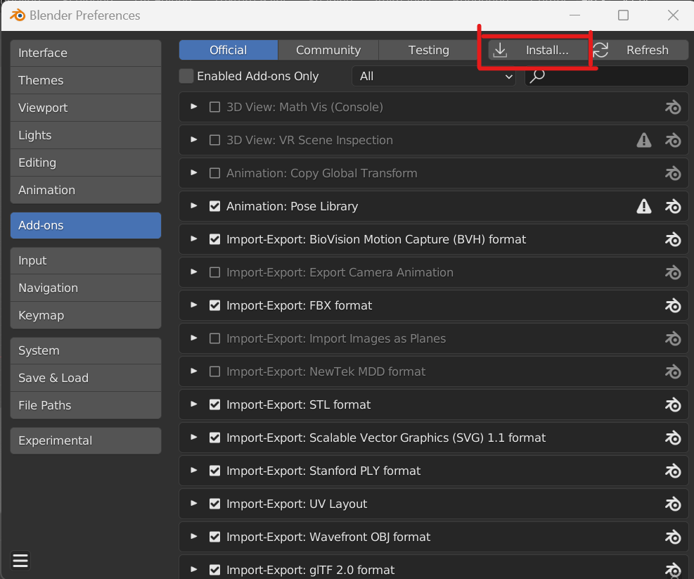
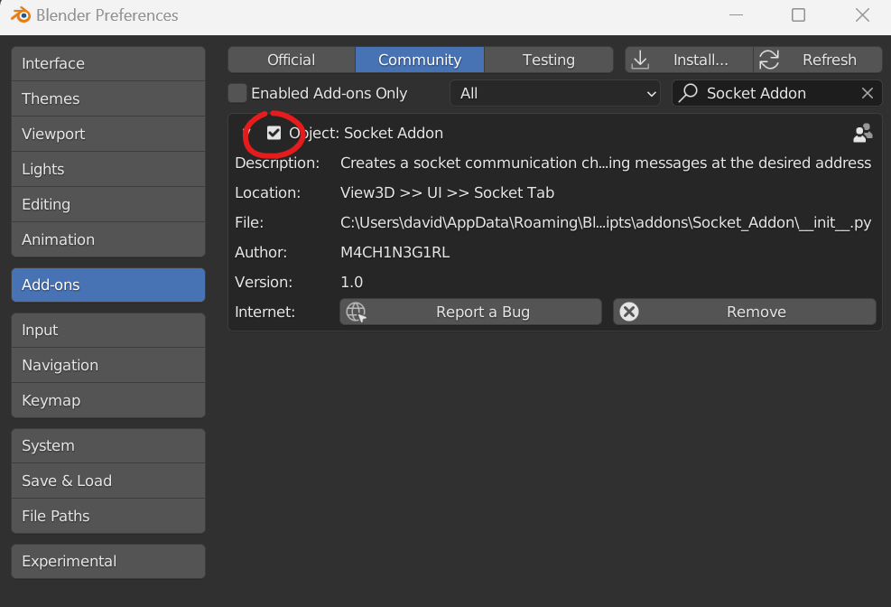
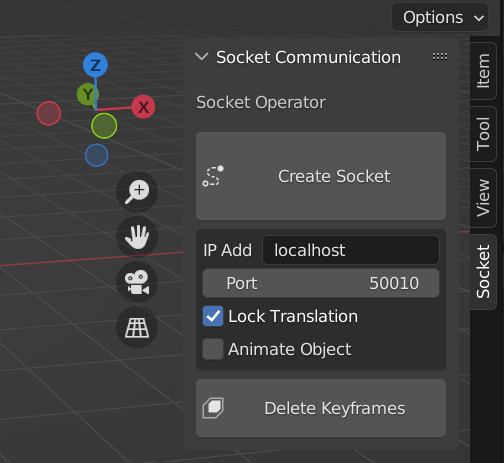
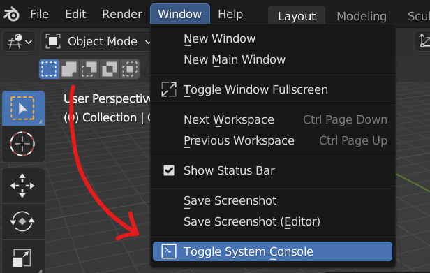
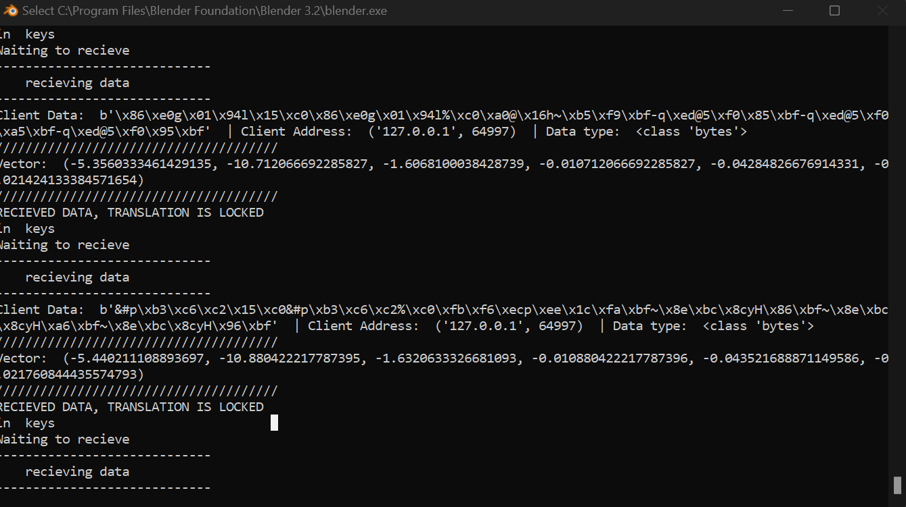

# Blender Socket Communication

This addon implements native Socket Communication (UDP//TCP IP) to Blender for data visualization purposes.

This implementation only uses built in standard Python libraries, hence no trouble installing third party libraries to the embeded Blender Python.

    *The module socketModule was tested with the Python version 3.10.5*

## Installation 

This module was developed under Blender version 3.2.0, related compatible versions should work without any problem (2.80 and up) 

### Blender Installation

Refer to Blender's [official website](https://www.blender.org/download/)

### Addon Installation

The simplest way to install the addon is importing the zip directly from Blender:

    *After the exiting Blender's Splash Screen, under the main toolbar go to: Edit >> Preferences

Go to the 'Add-ons' tab and click the Install button at the upper right corner and select the zip file included in this [repository](https://github.com/M4CH1N3G1RL/Blender-Socket-Communication.git).

Then click the checkbox next to the addon's name to activate in the current sesion.

## User Guide

At the 3D Viewport editor, open the Sidebar (while hovering the 3D Viewport editor,click 'n' on your keyboard) and go to the Socket tab.

The addon pannel includes easy to use buttons to enabling the creation of sockets binded to specific Addresses. Each object in the scene has a property binded to a specific address (Port,Address.

* *Create Socket*: Creates a socket for the selected object and binds it to the selected address, click *ESC* to kill socket.

* *IP Address*: This is where you type the remote IPV4 address, 'localhost' is the same as '127.0.0.1'. Data entry is string type.

* *Port*: Remote Port to recieve data from.

* *Lock Translation*: Locks the movement.

* *Animate Object*: Enables the keyframing for each of the received samples, click the play button (space) while this option is activated for animating in real time, depending on the sample rate this operation might result heavy.

* *Delete Keyframes*: Deletes all the animation data of the selected object.

## BEFORE YOU USE THIS 

-This addon is intended for a raw byte dataframe composed of 6 doubles [uint-64], for a given vector state. It is planned to add a dynamic/user input frame configurations for later implementation

-Input angles are in radians units

-The keyframing information is mapped to the delta properties (delta_location,delta_rotation_euler), this combined with the modal behaviour of the operator adds to a more dynamic and flexible adjustability

The addon still has lots of deuggin flags, where you can see the raw data, addresses, and a bunch of different statuses of the program. Just open Blender's system console under the main upper toolbar, go to Window >> Toggle System Console:

Flags can be checked at the commented sections of the source code 

-If the socket button is greyed out it means that the current object is still binded to a socket, click away then re-click to refresh this button.

-***JUST BIND ONE SOCKET AT A TIME***

This limitation is due to the lifespan of the operator. The socket object is binded to this operator, meaning that if clicked again on other object, the previous socket would not be killed, leaving the previous object's socket to reieve data to an object that does not exist anymore yet still open, if this situation is faced just spam the esc button to the involved objects. A workaround can be implemented if the socket is binded to the object and not the operator, kinda hard due to blender's API restrictions on custom properties datatypes...